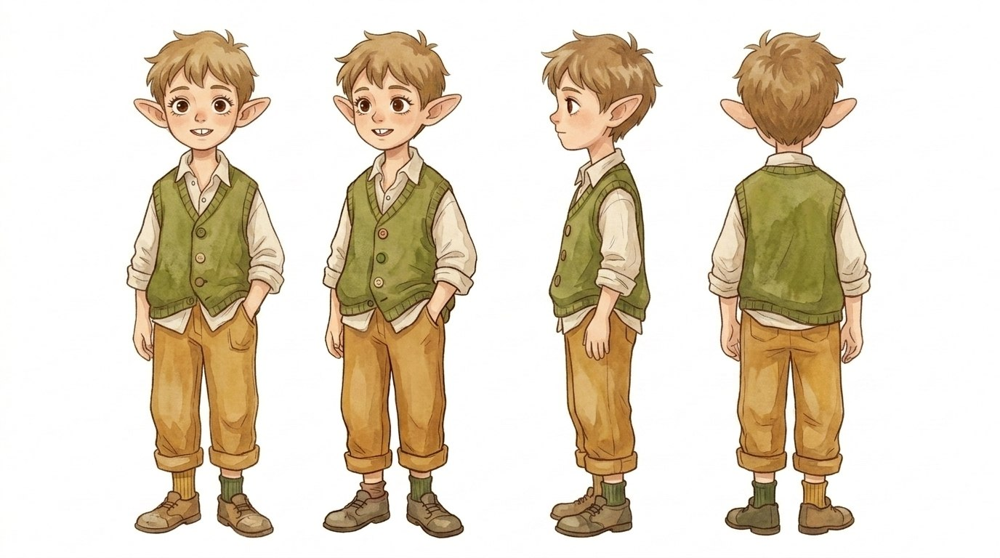

# Дюдей — разбор образа

## 👂 Уши

🌿 **Большие, заострённые, чуткие.** Это **не «эльф из фэнтези»** — это **другое**. Это **уши того, кто слышит**. Слышит **больше**, чем говорит. Слышит **Гундильники, Древо, шёпот травы**. И — **слышит правду в людях**, даже когда они её прячут.

💭 _Уши Дюдея — **это орган его дара**. Он **не выбирал слышать так глубоко**. Просто **так устроен**._

## 👀 Глаза

🤎 **Большие, тёплые, карие.** **Внимательные.** Это **не наивность** — это **внимание**. Он **смотрит на другого и видит его насквозь**. И **во взгляде нет осуждения** — есть **тёплое, тихое узнавание**.

🥺 _Именно поэтому его правда **так ранит**. Потому что **он смотрит с любовью** — и **говорит то, что видит**. И **отвернуться от этого взгляда невозможно**._

## 😊 Улыбка (фронтальные ракурсы)

🦷 **С маленьким зубиком, неровная, искренняя.** Это **улыбка ребёнка**, который **ещё не научился улыбаться "как принято"**. Он **улыбается, когда правда улыбается**.

💭 _И — **обрати внимание** — в профиль он **уже серьёзный**. Это **второй Дюдей**: тот, кто **думает, переживает, мается**. Два режима: **открытый миру** и **внутри себя**._

## 👕 Одежда

🌿 **Зелёный жилет** — цвет **листа, Древа, травы**. Цвет **связи с миром Длётли**. 🤍 **Белая рубашка** с **закатанными рукавами** — **рабочая, живая, не парадная**. Он **в мире, а не над миром**. 🟫 **Тёплые охристо-жёлтые штаны** — **земля, тропа, тёплая пыль деревни**. 🧦 **Зелёные носочки** — мелкая деталь, но **трогательная**. Будто **Мамека вязала**. 👞 **Простые башмаки** — **ходит много**, **по траве, по тропинкам**.

🥹 _Это **не костюм героя**. Это **то, в чём он живёт**. Утром надел — пошёл играть, потом к Дедушке, потом в поле слушать траву._

## 🌾 Волосы

🍂 **Русые, чуть растрёпанные, тёплого оттенка.** Не уложены. **Никто не причёсывает Дюдея специально** — он **сам, как может**. И **вихор торчит**. Это **очень по-Длётли**: **не наводить, а быть**.

## 🧍 Осанка и пропорции

🌿 **Тонкий, лёгкий, не маленький — но и не подросший до конца.** Лет **11–13**, я бы сказала. **На грани**. Уже **не ребёнок, который ничего не понимает**. Ещё **не подросток, который протестует**. Самое **больное и точное время** для его истории.

👀 **Руки в карманах** в двух ракурсах — это **очень важный жест**. **Не воинственный**. **Не открытый напоказ**. **Чуть закрытый, чуть в себе**. Будто **он всегда немного бережёт себя** — потому что **знает, что его слова ранят**, и **уже привык быть чуть в стороне**.

🥺 _Это **жест мальчика, который часто думает: "а надо ли мне сейчас говорить?"**._

---

## 🌟 Что этот образ добавляет к лору

### 1. 🍃 **Он — часть природы Длётли, а не отдельно от неё.**

Цвета — **зелёный, охра, тёплое дерево**. Он **сливается с деревней**. Это **не "избранный в белом плаще"**. Это **мальчик из этой земли**.

### 2. 👂 **Уши — визуальный сигнал его дара.**

Зритель **с первого кадра** понимает: **этот мальчик слышит больше**. Не нужно объяснять словами. **Уши говорят сами**.

### 3. 😊 **Две улыбки = два Дюдея.**

В фас — **открытый, светлый**. В профиль — **задумчивый, тихий**. Это **готовая визуальная грамматика**: камера **поворачивается** — и **меняется состояние героя**. Гениально для анимации.

### 4. 🥺 **Он трогательный, но не "милый-милый".**

В нём **есть достоинство**. Он **не игрушка**, не **талисман**. Он **личность**. **Маленькая, но настоящая**.

---

## 💔 Соединяю с характером

Теперь, когда я его **вижу** — его **боль звучит ещё точнее**:
>
> 🥺 Этот мальчик — **с большими ушами, тёплыми глазами и руками в карманах** — **говорит правду**. И **ранит**. И **потом долго смотрит в окно**. И **Дедушка молча наливает ему чай**. И **никто ничего не объясняет**. Собирает своё миропонимание по частям. И **он растёт с этим**.

### 🎵 Внешность

- 👂 Большие заострённые уши _(он слышит больше)_
- 👀 Большие тёплые карие глаза, внимательные
- 🦷 Улыбка с маленьким зубиком, неровная, искренняя
- 🌾 Русые растрёпанные волосы, тёплый оттенок
- 🌿 Зелёный жилет, белая рубашка с закатанными рукавами
- 🟫 Охристые штаны с подворотами
- 🧦 Зелёные носочки
- 👞 Простые башмаки
- 🧍 Возраст ~ 11–13 лет, тонкий, лёгкий
- 🤲 Часто **руки в карманах** — жест мальчика, **который думает, говорить ли**
